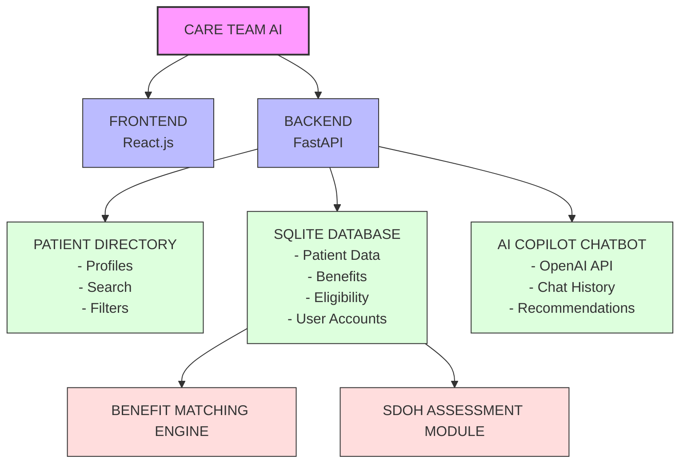

# Care Team AI

## Core Tech Stack

### Frontend
- **React.js** - Modern UI library for building interactive user interfaces
- **Tailwind CSS** - Utility-first CSS framework for rapid styling

### Backend
- **Python with FastAPI** - High-performance API framework with automatic documentation
- **SQLite db** - Lightweight database for simple deployment
- **JWT authentication** - Secure token-based authentication

### AI Integration
- **OpenAI API** - Advanced language models for intelligent processing

## Key Features

- 🤖 **AI Copilot for Care Team** - AI assistant to help navigate patient care
- 📊 **SDOH screening and risk factor score** - Social Determinants of Health assessment
- 🔍 **Patient portal directory** - Enhanced with:
  - AI-powered search capabilities
  - Priority ranking system
  - Customizable filter options

## System Architecture

